# FAAP Scan App - Component System Architecture

## Component Hierarchy Diagram

```mermaid
graph TB
    DS[Design System Foundation] --> DT[Design Tokens]
    
    DT --> C1[Colors]
    DT --> C2[Typography]
    DT --> C3[Spacing]
    DT --> C4[Shadows]
    DT --> C5[Border Radius]
    DT --> C6[Breakpoints]
    
    DS --> AT[Atoms]
    AT --> A1[Button]
    AT --> A2[Icon]
    AT --> A3[Text]
    AT --> A4[Input]
    AT --> A5[Badge]
    AT --> A6[Avatar]
    AT --> A7[Checkbox]
    AT --> A8[Radio]
    AT --> A9[Toggle]
    
    DS --> ML[Molecules]
    ML --> M1[Card]
    ML --> M2[List Item]
    ML --> M3[Search Bar]
    ML --> M4[Tab]
    ML --> M5[Notification]
    ML --> M6[Modal]
    ML --> M7[Toast]
    ML --> M8[Chip]
    ML --> M9[Progress Bar]
    
    DS --> OR[Organisms]
    OR --> O1[Header]
    OR --> O2[Navigation]
    OR --> O3[Product Card]
    OR --> O4[Scan Result]
    OR --> O5[Chart]
    OR --> O6[Form]
    OR --> O7[List]
    OR --> O8[Gallery]
    
    DS --> TM[Templates]
    TM --> T1[Main Layout]
    TM --> T2[Onboarding]
    TM --> T3[Dashboard]
    TM --> T4[Results]
    TM --> T5[Profile]
    
    DS --> PG[Pages]
    PG --> P1[Home]
    PG --> P2[Scan]
    PG --> P3[History]
    PG --> P4[Health]
    PG --> P5[Profile]

    style DS fill:#e3f2fd,stroke:#1976d2,stroke-width:3px
    style DT fill:#fff3e0,stroke:#ff9800,stroke-width:2px
    style AT fill:#e8f5e9,stroke:#4caf50,stroke-width:2px
    style ML fill:#f3e5f5,stroke:#9c27b0,stroke-width:2px
    style OR fill:#fce4ec,stroke:#e91e63,stroke-width:2px
    style TM fill:#e0f2f1,stroke:#009688,stroke-width:2px
    style PG fill:#f1f8e9,stroke:#689f38,stroke-width:2px
```

## Atomic Design System

### 1. Atoms (Basic Building Blocks)

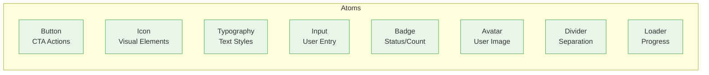

### 2. Molecules (Combinations)

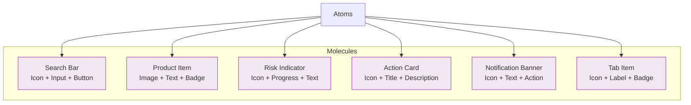

### 3. Organisms (Complex Components)

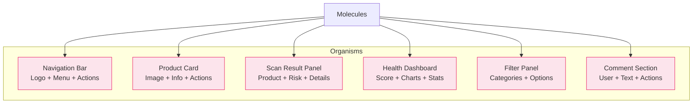

## Component State Management

```mermaid
stateDiagram-v2
    [*] --> Default
    Default --> Hover: Mouse Enter
    Default --> Focus: Tab/Click
    Default --> Active: Click/Tap
    Default --> Disabled: Prop Change
    Default --> Loading: Async Action
    
    Hover --> Default: Mouse Leave
    Focus --> Default: Blur
    Active --> Default: Release
    Disabled --> Default: Enable
    Loading --> Success: Complete
    Loading --> Error: Fail
    
    Success --> Default: Timeout
    Error --> Default: Retry/Dismiss
```

## Component Communication Flow

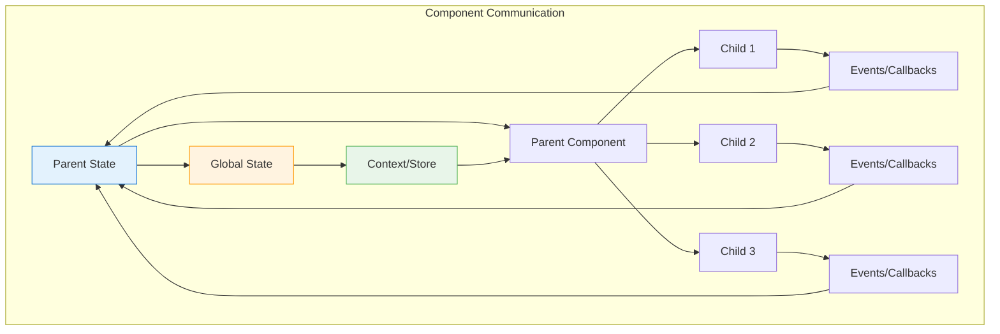

## Responsive Component Architecture

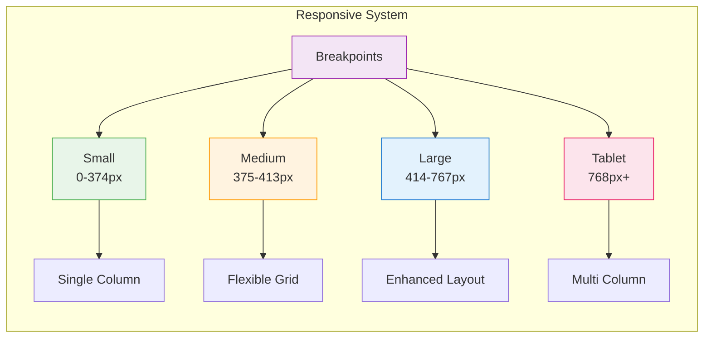

## Data Flow Architecture

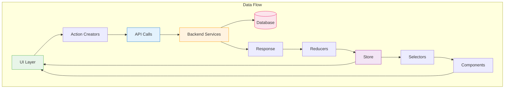

## Animation System

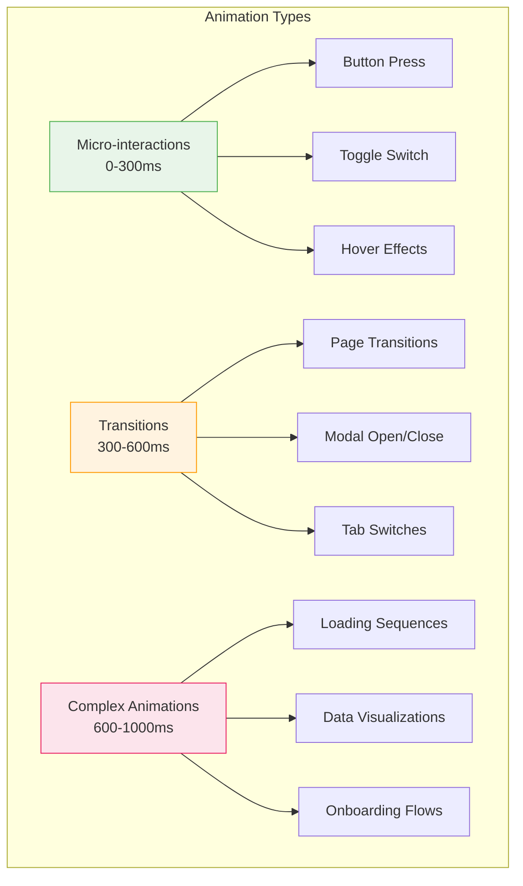

## Component Testing Strategy

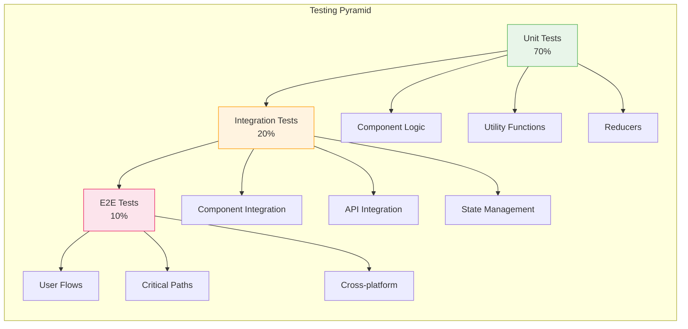

## Performance Optimization Flow

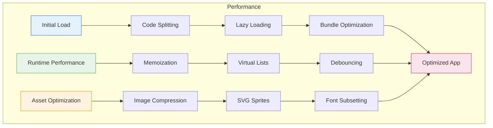

## Accessibility Component Tree

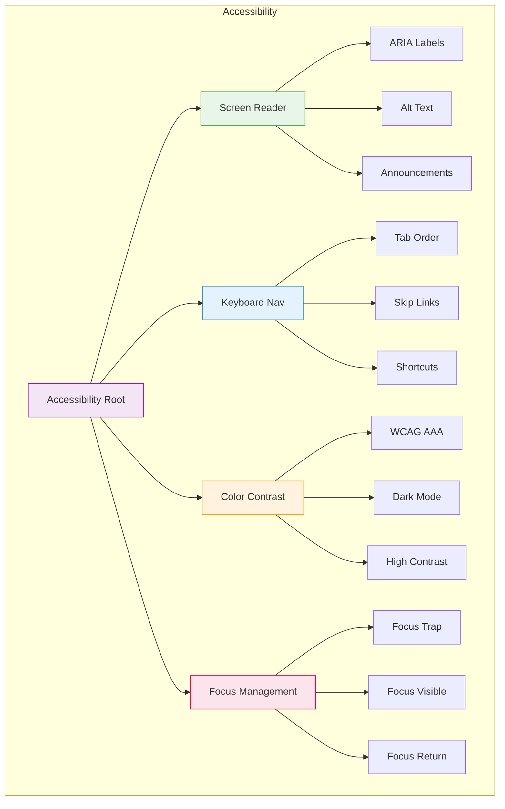

## Theme System Architecture

```mermaid
graph TD
    subgraph Theme System
        TS[Theme Provider] --> LT[Light Theme]
        TS --> DT[Dark Theme]
        TS --> CT[Custom Theme]
        
        LT --> LC[Light Colors]
        LT --> LF[Light Fonts]
        LT --> LS[Light Shadows]
        
        DT --> DC[Dark Colors]
        DT --> DF[Dark Fonts]
        DT --> DS[Dark Shadows]
        
        CT --> UC[User Colors]
        CT --> UF[User Fonts]
        CT --> US[User Settings]
        
        TS --> COMP[Components]
        COMP --> UI[UI Render]
    end

    style TS fill:#e3f2fd,stroke:#1976d2
    style LT fill:#fff,stroke:#757575
    style DT fill:#212121,stroke:#fff
    style CT fill:#f3e5f5,stroke:#9c27b0
```