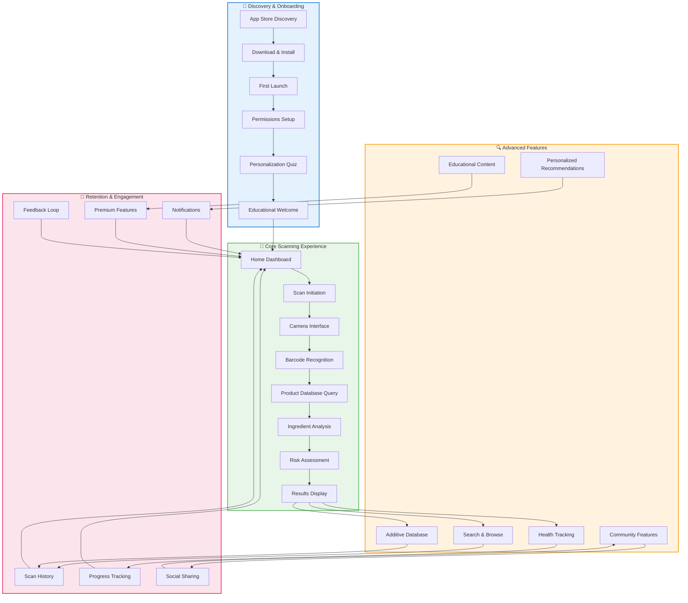
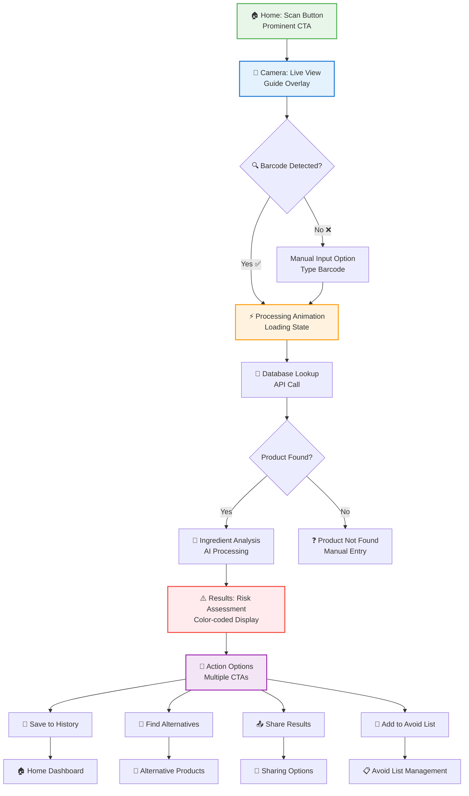
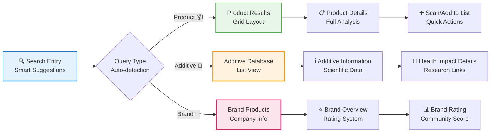
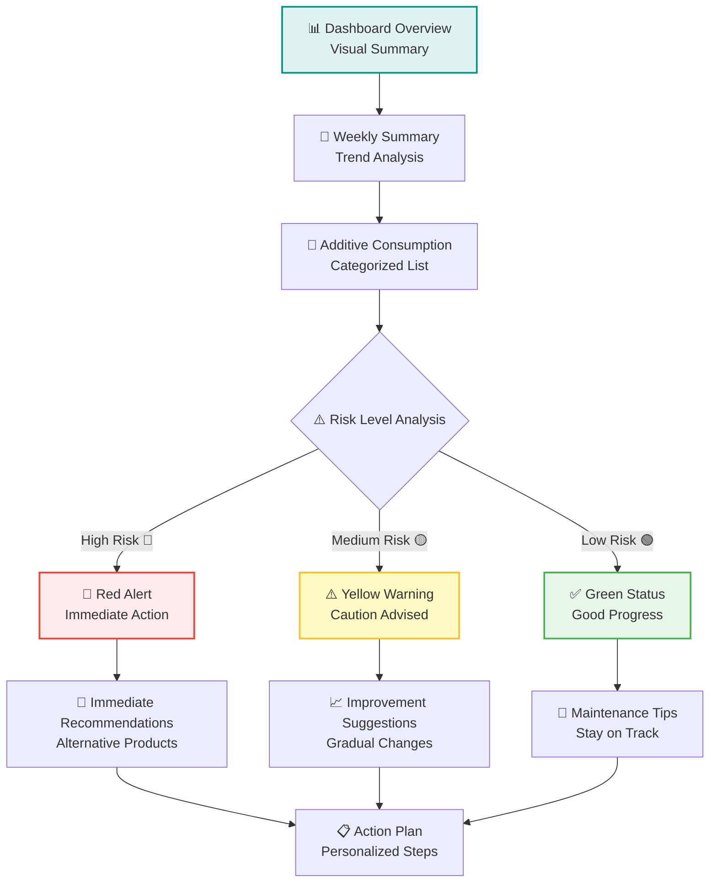
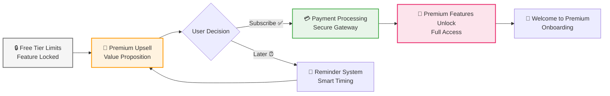
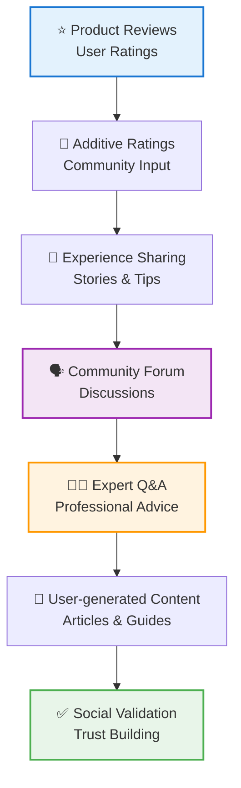
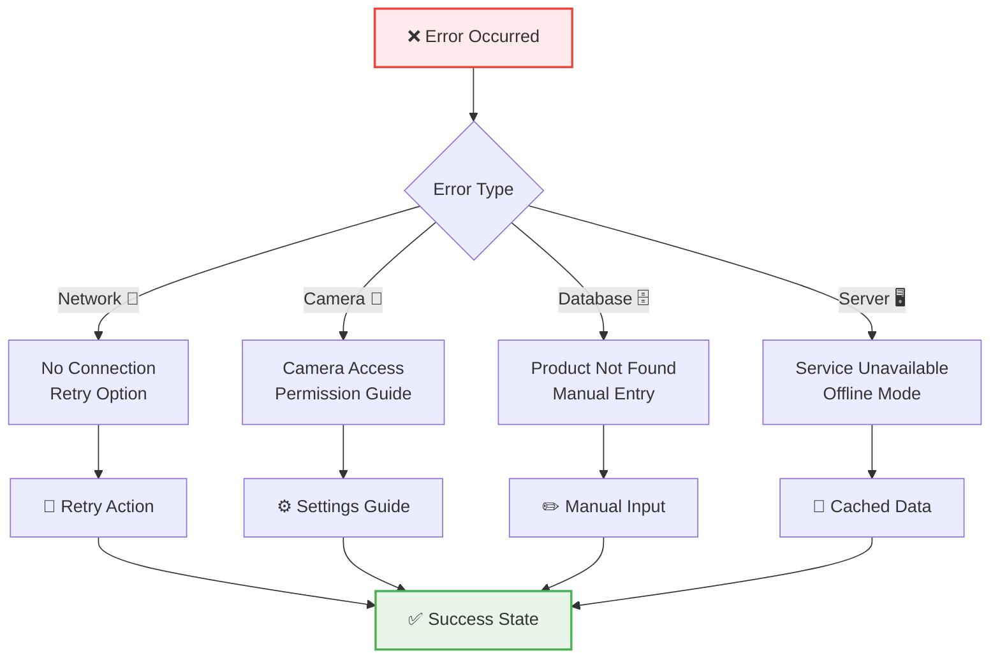
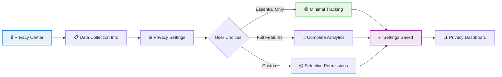

# FAAP Scan App - Complete Flow Charts and UI/UX Design

## 1. Master User Journey Map

## 2. Detailed Onboarding Flow

```mermaid
graph LR
    O1["🎨 Splash Screen<br/>Brand Identity<br/>2-3 seconds"] --> O2["💡 Value Proposition<br/>Health Benefits<br/>Skip option"]
    O2 --> O3["🔐 Permissions Request<br/>Camera, Notifications<br/>Required & Optional"]
    O3 --> O4["👤 Health Profile Setup<br/>Allergies, Preferences<br/>Personalization"]
    O4 --> O5["📖 Quick Tutorial<br/>Scan Demonstration<br/>Interactive Guide"]
    O5 --> H["🏠 Home Dashboard<br/>Personalized Experience"]

    style O1 fill:#e3f2fd,stroke:#1976d2,stroke-width:2px
    style O2 fill:#e8f5e9,stroke:#4caf50,stroke-width:2px
    style O3 fill:#fff3e0,stroke:#ff9800,stroke-width:2px
    style O4 fill:#fce4ec,stroke:#e91e63,stroke-width:2px
    style O5 fill:#f3e5f5,stroke:#9c27b0,stroke-width:2px
    style H fill:#e0f2f1,stroke:#009688,stroke-width:2px
```

## 3. Scanning Flow with Decision Points

## 4. Search & Discovery Flow

## 5. Health Tracking Flow

## 6. Premium Feature Conversion Flow

## 7. Community Engagement Flow

## 8. Error & Recovery Flow

## 9. Data Privacy & Security Flow

## 10. Notification Management Flow

```mermaid
graph TD
    N1["🔔 Notification Settings"] --> N2{"Notification Types"}
    N2 -->|Health Alerts 🏥| N3["Risk Warnings<br/>Immediate"]
    N2 -->|Product Updates 📦| N4["New Scans<br/>Daily Digest"]
    N2 -->|Community 👥| N5["Social Activity<br/>Weekly Summary"]
    N2 -->|Educational 📚| N6["Tips & Articles<br/>Bi-weekly"]
    
    N3 --> N7["⚙️ Frequency Settings"]
    N4 --> N7
    N5 --> N7
    N6 --> N7
    
    N7 --> N8["💾 Save Preferences"]
    N8 --> N9["✅ Notifications Configured"]

    style N1 fill:#fff3e0,stroke:#ff9800,stroke-width:2px
    style N3 fill:#ffebee,stroke:#f44336,stroke-width:2px
    style N9 fill:#e8f5e9,stroke:#4caf50,stroke-width:2px
```

