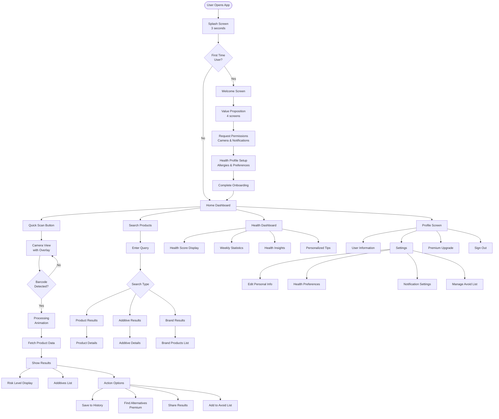
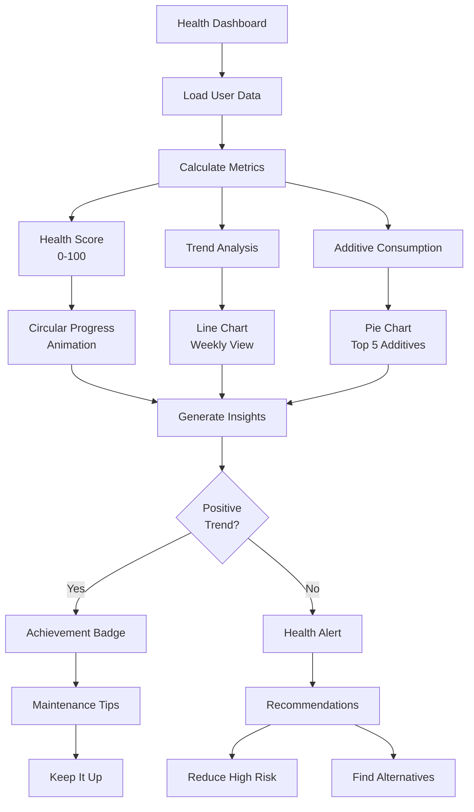
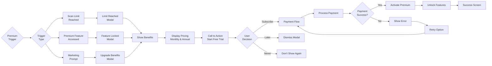
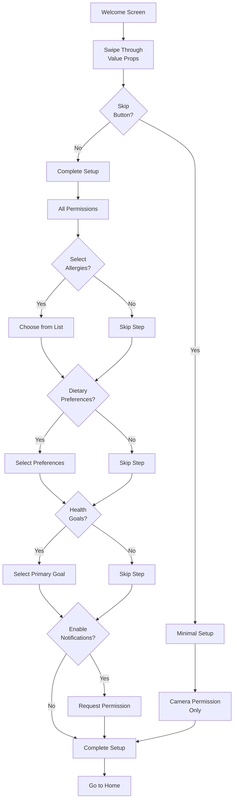

# FAAP Scan App - User Flow Diagrams

## Main User Flow

```mermaid
flowchart TB
    Start([User Opens App]) --> SplashScreen[Splash Screen<br/>3 seconds]
    
    SplashScreen --> CheckOnboarding{First Time<br/>User?}
    
    CheckOnboarding -->|Yes| OnboardingStart[Welcome Screen]
    CheckOnboarding -->|No| HomeScreen[Home Dashboard]
    
    %% Onboarding Flow
    OnboardingStart --> ValueProp[Value Proposition<br/>4 screens]
    ValueProp --> Permissions[Request Permissions<br/>Camera & Notifications]
    Permissions --> HealthProfile[Health Profile Setup<br/>Allergies & Preferences]
    HealthProfile --> OnboardingComplete[Complete Onboarding]
    OnboardingComplete --> HomeScreen
    
    %% Main Navigation
    HomeScreen --> QuickScan[Quick Scan Button]
    HomeScreen --> Search[Search Products]
    HomeScreen --> HealthDash[Health Dashboard]
    HomeScreen --> Profile[Profile Screen]
    
    %% Scanning Flow
    QuickScan --> CameraView[Camera View<br/>with Overlay]
    CameraView --> BarcodeDetect{Barcode<br/>Detected?}
    BarcodeDetect -->|No| CameraView
    BarcodeDetect -->|Yes| Processing[Processing<br/>Animation]
    Processing --> APICall[Fetch Product Data]
    APICall --> ResultsScreen[Show Results]
    
    ResultsScreen --> RiskAssessment[Risk Level Display]
    ResultsScreen --> AdditiveList[Additives List]
    ResultsScreen --> Actions[Action Options]
    
    Actions --> SaveHistory[Save to History]
    Actions --> FindAlternatives[Find Alternatives<br/>Premium]
    Actions --> ShareResults[Share Results]
    Actions --> AddAvoidList[Add to Avoid List]
    
    %% Search Flow
    Search --> SearchInput[Enter Query]
    SearchInput --> SearchType{Search Type}
    SearchType --> ProductSearch[Product Results]
    SearchType --> AdditiveSearch[Additive Results]
    SearchType --> BrandSearch[Brand Results]
    
    ProductSearch --> ProductDetails[Product Details]
    AdditiveSearch --> AdditiveDetails[Additive Details]
    BrandSearch --> BrandProducts[Brand Products List]
    
    %% Health Dashboard Flow
    HealthDash --> HealthScore[Health Score Display]
    HealthDash --> WeeklyStats[Weekly Statistics]
    HealthDash --> Insights[Health Insights]
    HealthDash --> Recommendations[Personalized Tips]
    
    %% Profile Flow
    Profile --> UserInfo[User Information]
    Profile --> Settings[Settings]
    Profile --> Premium[Premium Upgrade]
    Profile --> SignOut[Sign Out]
    
    Settings --> PersonalInfo[Edit Personal Info]
    Settings --> HealthPrefs[Health Preferences]
    Settings --> Notifications[Notification Settings]
    Settings --> AvoidList[Manage Avoid List]
```

## Detailed Scanning Flow

```mermaid
flowchart LR
    Start([Tap Scan]) --> Camera[Camera Activated]
    Camera --> Frame[Position Barcode<br/>in Frame]
    Frame --> Detect{Barcode<br/>Detected?}
    
    Detect -->|No| Manual[Manual Entry<br/>Option]
    Detect -->|Yes| Vibrate[Haptic Feedback]
    
    Manual --> EnterCode[Enter Barcode<br/>Number]
    EnterCode --> Validate{Valid<br/>Format?}
    Validate -->|No| Error1[Show Error]
    Validate -->|Yes| Process
    Error1 --> EnterCode
    
    Vibrate --> Process[Processing<br/>Animation]
    Process --> DBCheck{In Local<br/>Database?}
    
    DBCheck -->|Yes| LoadLocal[Load from Cache]
    DBCheck -->|No| APIFetch[Fetch from API]
    
    APIFetch --> APIResponse{API<br/>Success?}
    APIResponse -->|No| Error2[Product Not Found]
    APIResponse -->|Yes| SaveLocal[Save to Cache]
    
    LoadLocal --> Analyze[Analyze Additives]
    SaveLocal --> Analyze
    
    Analyze --> RiskCalc[Calculate Risk Level]
    RiskCalc --> CheckAvoid{Contains<br/>Avoided<br/>Additives?}
    
    CheckAvoid -->|Yes| HighRisk[Mark High Risk]
    CheckAvoid -->|No| NormalRisk[Normal Risk Level]
    
    HighRisk --> ShowResults[Display Results]
    NormalRisk --> ShowResults
    
    ShowResults --> UserAction{User<br/>Action}
    UserAction --> Save[Save to History]
    UserAction --> Share[Share Results]
    UserAction --> Alternatives[Find Alternatives]
    UserAction --> NewScan[Scan Another]
```

## Health Tracking Flow

```mermaid
flowchart TD
    Dashboard[Health Dashboard] --> LoadData[Load User Data]
    LoadData --> Calculate[Calculate Metrics]
    
    Calculate --> Score[Health Score<br/>0-100]
    Calculate --> Trends[Trend Analysis]
    Calculate --> Consumption[Additive Consumption]
    
    Score --> Display1[Circular Progress<br/>Animation]
    Trends --> Display2[Line Chart<br/>Weekly View]
    Consumption --> Display3[Pie Chart<br/>Top 5 Additives]
    
    Display1 --> Insights[Generate Insights]
    Display2 --> Insights
    Display3 --> Insights
    
    Insights --> Positive{Positive<br/>Trend?}
    Positive -->|Yes| GoodJob[Achievement Badge]
    Positive -->|No| Warning[Health Alert]
    
    Warning --> Recommend[Recommendations]
    GoodJob --> Tips[Maintenance Tips]
    
    Recommend --> Action1[Reduce High Risk]
    Recommend --> Action2[Find Alternatives]
    Tips --> Action3[Keep It Up]
```

## Premium Conversion Flow

```mermaid
flowchart LR
    Trigger{Premium<br/>Trigger} --> Type{Trigger<br/>Type}
    
    Type --> Limit[Scan Limit<br/>Reached]
    Type --> Feature[Premium Feature<br/>Accessed]
    Type --> Prompt[Marketing<br/>Prompt]
    
    Limit --> Modal1[Limit Reached<br/>Modal]
    Feature --> Modal2[Feature Locked<br/>Modal]
    Prompt --> Modal3[Upgrade Benefits<br/>Modal]
    
    Modal1 --> Benefits[Show Benefits]
    Modal2 --> Benefits
    Modal3 --> Benefits
    
    Benefits --> Pricing[Display Pricing<br/>Monthly & Annual]
    Pricing --> CTA[Call to Action<br/>Start Free Trial]
    
    CTA --> Decision{User<br/>Decision}
    Decision -->|Subscribe| Payment[Payment Flow]
    Decision -->|Later| Dismiss[Dismiss Modal]
    Decision -->|Never| OptOut[Don't Show Again]
    
    Payment --> Process[Process Payment]
    Process --> Success{Payment<br/>Success?}
    
    Success -->|Yes| Activate[Activate Premium]
    Success -->|No| Error[Show Error]
    
    Activate --> Unlock[Unlock Features]
    Unlock --> Confirm[Success Screen]
    
    Error --> Retry[Retry Option]
    Retry --> Payment
```

## Onboarding Decision Tree

```mermaid
flowchart TD
    Start[Welcome Screen] --> Swipe[Swipe Through<br/>Value Props]
    Swipe --> Skip{Skip<br/>Button?}
    
    Skip -->|Yes| QuickSetup[Minimal Setup]
    Skip -->|No| FullSetup[Complete Setup]
    
    QuickSetup --> BasicPerms[Camera Permission<br/>Only]
    FullSetup --> AllPerms[All Permissions]
    
    AllPerms --> Allergies{Select<br/>Allergies?}
    Allergies -->|Yes| AllergyList[Choose from List]
    Allergies -->|No| SkipAllergies[Skip Step]
    
    AllergyList --> Dietary{Dietary<br/>Preferences?}
    SkipAllergies --> Dietary
    
    Dietary -->|Yes| DietList[Select Preferences]
    Dietary -->|No| SkipDiet[Skip Step]
    
    DietList --> Goals{Health<br/>Goals?}
    SkipDiet --> Goals
    
    Goals -->|Yes| GoalSelect[Select Primary Goal]
    Goals -->|No| SkipGoals[Skip Step]
    
    GoalSelect --> Notifications{Enable<br/>Notifications?}
    SkipGoals --> Notifications
    
    Notifications -->|Yes| NotifPerms[Request Permission]
    Notifications -->|No| Complete[Complete Setup]
    
    NotifPerms --> Complete
    BasicPerms --> Complete
    
    Complete --> Home[Go to Home]
```